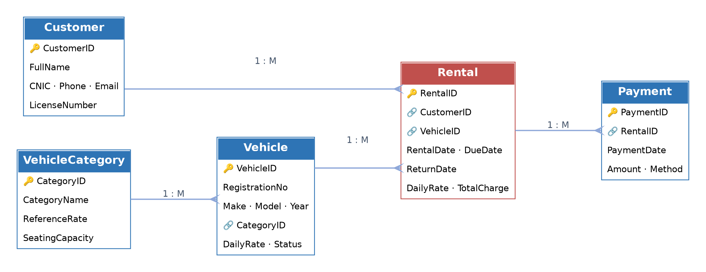

# 🚗 CarGo Rentals — Car Rental Management System

**Database Management System · Open-Ended Lab · CLO-6 (Analyze) & CLO-7 (Design/Develop)**

| | |
|---|---|
| **Course** | Database Management Systems (Lab) |
| **Lab Type** | Open-Ended Lab Assignment |
| **CLOs Assessed** | CLO-6 (C-4: Analyze), CLO-7 (C-5: Design/Develop) |
| **DBMS / Engine** | MySQL 8.x / InnoDB |
| **Database Name** | `carrental_db` |
| **Total Marks** | 20 |
| **Primary Script** | [`CarRental_OpenEndedLab.sql`](CarRental_OpenEndedLab.sql) |
| **Diagram** | [`erd.png`](erd.png) |
| **Name** | Shahzad Ahmed Awan |
| **Roll No** | 2024-SE-15 |

---

## 📋 Requirements Traceability

| Lab Requirement | SQL Section | README Section |
|---|---|---|
| Database creation | Section 0 | §2 |
| Tables and attributes | Section 1.1 | §2 |
| Primary/Foreign Keys | Section 1.1 | §2 |
| Constraints | Section 1.1 | §2 |
| Sample data | Section 1.2 | §3 |
| Verification | Section 1.3 | §3 |
| 1NF | Section 2.2 | §4 |
| 2NF | Section 2.3 | §4 |
| 3NF | Section 2.4 | §4 |
| Insert/Update/Delete anomalies | Section 2.1 | §4 |
| JOIN Query 1 | Section 3 | §5 |
| JOIN Query 2 | Section 3 | §5 |
| JOIN Query 3 | Section 3 | §5 |
| JOIN Query 4 | Section 3 | §5 |
| VIEW | Section 4 | §6 |
| TRIGGER | Section 5 | §7 |
| Stored Procedure | Section 6 | §8 |
| Weakness / inefficiency | Section 7 | §9 |
| Proposed optimization | Section 7 | §9 |
| Before/After verification | Section 7 | §9 |
| Final testing | Section 8 | §10 |

---

### 📖 Contents

| | | |
|---|---|---|
| [1 · The Problem](#1--the-problem) | [4 · Normalization](#4--normalization-fixing-the-flat-record) | [7 · Trigger](#7--trigger-the-one-rule-the-tables-cant-enforce) |
| [2 · The Design](#2--the-design) | [5 · Join Queries](#5--join-queries-the-four-business-questions) | [8 · Stored Procedures](#8--stored-procedures-the-daily-workflow) |
| [3 · Sample Data](#3--sample-data) | [6 · View](#6--view-one-screen-for-everything) | [9 · Optimization](#9--optimization) |

---

## 1 · The Problem

CarGo Rentals runs its business on spreadsheets. One row per rental, everything about the customer and the car crammed into that same row.

| Symptom the company reports | Root cause |
|---|---|
| "Duplicate information" | Customer and vehicle facts are retyped into every rental row |
| "Inconsistent records" | The same customer can end up with two different phone numbers on file |
| "Difficulty generating reports" | No structure to query — everything lives in one flat sheet |
| A car gets rented twice at once | Nothing checks whether the car is already out |

**Goal:** replace the sheet with a relational database that removes the duplication, calculates charges automatically, blocks double-booking, and answers management's reporting questions instantly.

---

## 2 · The Design

### Entity–Relationship Diagram



### Five tables, each solving one piece of the problem

| Table | What it stores | Why it had to be separate |
|---|---|---|
| `Customer` | People who rent | A person exists before and after any single booking |
| `VehicleCategory` | Economy / Sedan / SUV / Van | Tariff and seating belong to the *category*, not to one car |
| `Vehicle` | The fleet | One car is rented dozens of times over its life |
| `Rental` | The contract | Links a customer to a vehicle for a period, and carries the price |
| `Payment` | Money received | One rental can be paid in more than one instalment |

### How they connect

| From | Relationship | To | Meaning |
|---|---|---|---|
| Customer | 1 → many | Rental | A customer can make many bookings |
| Vehicle | 1 → many | Rental | A car is booked repeatedly over time |
| VehicleCategory | 1 → many | Vehicle | A category classifies many cars |
| Rental | 1 → many | Payment | A booking can be settled in instalments |

### Three decisions worth explaining

| Decision | The question it answers | The reasoning |
|---|---|---|
| `Rental` stores its **own** daily rate | Isn't that a duplicate of `Vehicle`'s rate? | No — `Vehicle.DailyRate` is *today's* price; `Rental.DailyRate` is the price that customer *agreed to*. If the tariff rises next month, old invoices must stay unchanged. |
| `Rental` has **no** status column | How do we know if a booking is still open? | It's derived: `ReturnDate IS NULL` **means** open. A stored status could fall out of sync with reality — one less thing to maintain. |
| `Vehicle` **does** have a status column | Why store status here but not on Rental? | "In the workshop" isn't something a rental record can tell you. It has to live on the vehicle, and it's kept accurate automatically (see §7). |

### Rules applied to every table

| Table | Primary key | Points to | Rule enforced |
|---|---|---|---|
| Customer | CustomerID | — | CNIC, phone, email and licence must each be unique |
| VehicleCategory | CategoryID | — | Rate must be positive; seats between 2 and 20 |
| Vehicle | VehicleID | VehicleCategory | Rate must be positive; model year between 1990–2100 |
| Rental | RentalID | Customer, Vehicle | Due date can't be before the rental date |
| Payment | PaymentID | Rental *(cascades on delete)* | Amount must be positive |

### Core Schema DDL

```sql
CREATE DATABASE IF NOT EXISTS carrental_db;
USE carrental_db;

CREATE TABLE Customer (
    CustomerID    INT             AUTO_INCREMENT PRIMARY KEY,
    FullName      VARCHAR(60)     NOT NULL,
    CNIC          CHAR(15)        NOT NULL UNIQUE,
    Phone         VARCHAR(15)     NOT NULL UNIQUE,
    Email         VARCHAR(60)     NULL     UNIQUE,
    City          VARCHAR(30)     NULL,
    LicenseNumber VARCHAR(20)     NOT NULL UNIQUE,
    RegisteredOn  DATE            NOT NULL DEFAULT (CURRENT_DATE),
    CONSTRAINT chk_customer_cnic CHECK (CHAR_LENGTH(CNIC) = 15)
) ENGINE = InnoDB;

CREATE TABLE VehicleCategory (
    CategoryID      INT           AUTO_INCREMENT PRIMARY KEY,
    CategoryName    VARCHAR(20)   NOT NULL UNIQUE,
    ReferenceRate   DECIMAL(8,2)  NOT NULL,
    SeatingCapacity TINYINT       NOT NULL,
    CONSTRAINT chk_category_rate  CHECK (ReferenceRate > 0),
    CONSTRAINT chk_category_seats CHECK (SeatingCapacity BETWEEN 2 AND 20)
) ENGINE = InnoDB;

CREATE TABLE Vehicle (
    VehicleID      INT            AUTO_INCREMENT PRIMARY KEY,
    RegistrationNo VARCHAR(15)    NOT NULL UNIQUE,
    Make           VARCHAR(25)    NOT NULL,
    Model          VARCHAR(30)    NOT NULL,
    ModelYear      SMALLINT       NOT NULL,
    CategoryID     INT            NOT NULL,
    DailyRate      DECIMAL(8,2)   NOT NULL,
    Status         ENUM('Available','Rented','Maintenance') NOT NULL DEFAULT 'Available',
    Odometer       INT            NOT NULL DEFAULT 0,
    CONSTRAINT fk_vehicle_category FOREIGN KEY (CategoryID) REFERENCES VehicleCategory(CategoryID),
    CONSTRAINT chk_vehicle_rate CHECK (DailyRate > 0),
    CONSTRAINT chk_vehicle_year CHECK (ModelYear BETWEEN 1990 AND 2100)
) ENGINE = InnoDB;

CREATE TABLE Rental (
    RentalID      INT             AUTO_INCREMENT PRIMARY KEY,
    CustomerID    INT             NOT NULL,
    VehicleID     INT             NOT NULL,
    RentalDate    DATE            NOT NULL,
    DueDate       DATE            NOT NULL,
    ReturnDate    DATE            NULL,
    DailyRate     DECIMAL(8,2)    NOT NULL,
    LateFeePerDay DECIMAL(8,2)    NOT NULL DEFAULT 0,
    TotalCharge   DECIMAL(10,2)   NULL,
    CONSTRAINT fk_rental_customer FOREIGN KEY (CustomerID) REFERENCES Customer(CustomerID),
    CONSTRAINT fk_rental_vehicle  FOREIGN KEY (VehicleID)  REFERENCES Vehicle(VehicleID),
    CONSTRAINT chk_rental_due     CHECK (DueDate >= RentalDate),
    CONSTRAINT chk_rental_return  CHECK (ReturnDate IS NULL OR ReturnDate >= RentalDate)
) ENGINE = InnoDB;

CREATE TABLE Payment (
    PaymentID   INT           AUTO_INCREMENT PRIMARY KEY,
    RentalID    INT           NOT NULL,
    PaymentDate DATE          NOT NULL DEFAULT (CURRENT_DATE),
    Amount      DECIMAL(10,2) NOT NULL,
    Method      ENUM('Cash','Card','Bank Transfer','Mobile Wallet') NOT NULL DEFAULT 'Cash',
    Reference   VARCHAR(40)   NULL,
    CONSTRAINT fk_payment_rental FOREIGN KEY (RentalID) REFERENCES Rental(RentalID) ON DELETE CASCADE,
    CONSTRAINT chk_payment_amount CHECK (Amount > 0)
) ENGINE = InnoDB;
```

---

## 3 · Sample Data

Forty-six rows, deliberately planted with gaps so every later demonstration has something real to point at. Shown exactly as `SELECT * FROM <table>;` would return it.

### Database Row Counts Verification

```sql
SELECT 'Customer' AS TableName, COUNT(*) AS TotalRows FROM Customer
UNION ALL SELECT 'VehicleCategory', COUNT(*) FROM VehicleCategory
UNION ALL SELECT 'Vehicle',         COUNT(*) FROM Vehicle
UNION ALL SELECT 'Rental',          COUNT(*) FROM Rental
UNION ALL SELECT 'Payment',         COUNT(*) FROM Payment;
```

| TableName | TotalRows |
|---|:---:|
| Customer | 8 |
| VehicleCategory | 4 |
| Vehicle | 10 |
| Rental | 13 |
| Payment | 11 |

### VehicleCategory — 4 rows

| CategoryID | CategoryName | ReferenceRate | SeatingCapacity |
|:---:|---|---:|:---:|
| 1 | Economy | 4500.00 | 4 |
| 2 | Sedan | 6500.00 | 5 |
| 3 | SUV | 12000.00 | 7 |
| 4 | Van | 12000.00 | 12 |

### Customer — 8 rows

| CustomerID | FullName | City | Email |
|:---:|---|---|---|
| 1 | Ali Khan | Lahore | ali.khan@gmail.com |
| 2 | Sara Iqbal | Lahore | sara.iqbal@gmail.com |
| 3 | Bilal Ahmed | Karachi | NULL |
| 4 | Fatima Sheikh | Islamabad | f.sheikh@outlook.com |
| 5 | Usman Tariq | Islamabad | usman.t@gmail.com |
| 6 | Ayesha Noor | Karachi | ayesha.noor@gmail.com |
| 7 | Zain Abbas | Lahore | NULL |
| 8 | Hira Yousaf | Muzaffarabad | hira.y@gmail.com |

*8 rows in set.*

### Vehicle — 10 rows

| VehicleID | RegistrationNo | Make | Model | DailyRate | Status |
|:---:|---|---|---|---:|---|
| 1 | LEB-4521 | Toyota | Corolla | 6500.00 | Available |
| 2 | LEA-7788 | Honda | City | 6000.00 | Available |
| 3 | KHI-3092 | Suzuki | Cultus | 4000.00 | Available |
| 4 | ISB-1145 | Suzuki | Alto | 4500.00 | Available |
| 5 | LEC-9001 | Toyota | Fortuner | 14000.00 | **Rented** |
| 6 | KHI-6612 | Kia | Sportage | 11000.00 | **Rented** |
| 7 | ISB-8834 | Toyota | Hiace | 12000.00 | Available |
| 8 | LEB-2210 | Honda | Civic | 8500.00 | **Rented** |
| 9 | KHI-4455 | Suzuki | Wagon R | 4200.00 | **Maintenance** |
| 10 | ISB-3377 | Toyota | Land Cruiser | 25000.00 | Available |

*10 rows in set.* — Vehicle 10 has never appeared in `Rental`; vehicle 9 is blocked from booking (§7).

### Rental — 13 rows

| RentalID | CustomerID | VehicleID | RentalDate | DueDate | ReturnDate | TotalCharge |
|:---:|:---:|:---:|---|---|---|---:|
| 1 | 1 | 1 | 2026-06-01 | 2026-06-04 | 2026-06-04 | 19500.00 |
| 2 | 2 | 3 | 2026-06-10 | 2026-06-12 | 2026-06-13 | 13000.00 |
| 3 | 3 | 2 | 2026-06-15 | 2026-06-20 | 2026-06-20 | 30000.00 |
| 4 | 4 | 5 | 2026-07-01 | 2026-07-05 | 2026-07-05 | 56000.00 |
| 5 | 1 | 4 | 2026-07-08 | 2026-07-10 | 2026-07-10 | 9000.00 |
| 6 | 5 | 7 | 2026-07-15 | 2026-07-22 | 2026-07-24 | 114000.00 |
| 7 | 6 | 6 | 2026-08-01 | 2026-08-04 | 2026-08-04 | 33000.00 |
| 8 | 2 | 8 | 2026-08-05 | 2026-08-09 | 2026-08-09 | 34000.00 |
| 9 | 3 | 1 | 2026-08-12 | 2026-08-15 | 2026-08-16 | 27625.00 |
| 10 | 1 | 2 | 2026-09-05 | 2026-09-08 | 2026-09-08 | 18000.00 |
| 11 | 4 | 5 | 2026-09-16 | 2026-09-20 | **NULL** | **NULL** |
| 12 | 6 | 8 | 2026-09-17 | 2026-09-19 | **NULL** | **NULL** |
| 13 | 5 | 6 | 2026-09-18 | 2026-09-25 | **NULL** | **NULL** |

*13 rows in set.* — `ReturnDate IS NULL` marks rentals 11, 12, 13 as still open; `TotalCharge` is only computed once a rental closes.

### Payment — 11 rows

| PaymentID | RentalID | Amount | Method |
|:---:|:---:|---:|---|
| 1 | 1 | 19500.00 | Card |
| 2 | 2 | 13000.00 | Cash |
| 3 | 3 | 30000.00 | Bank Transfer |
| 4 | 4 | 56000.00 | Card |
| 5 | 5 | 9000.00 | Cash |
| 6 | 6 | 100000.00 | Bank Transfer |
| 7 | 7 | 33000.00 | Card |
| 8 | 8 | 34000.00 | Mobile Wallet |
| 9 | 9 | 27625.00 | Cash |
| 10 | 10 | 18000.00 | Card |
| 11 | 11 | 30000.00 | Card |

*11 rows in set.* — Rental 6 was billed 114,000 but only 100,000 was paid; rental 11 has a 30,000 advance against a booking that hasn't closed yet.

---

## 4 · Normalization: fixing the flat record

### The flat record the company uses today (UNF)

| RentalID | CustomerName | CustomerPhone | VehicleNumber | VehicleModel | DailyRate | RentalDate | ReturnDate | PaymentAmount |
|---|---|---|---|---|---|---|---|---|
| R001 | Ali Khan | 0300-1234567 | ABC-123 | Toyota Corolla | 5000 | 2026-09-01 | 2026-09-04 | 15000 |
| R002 | Ali Khan | 0300-1234567 | XYZ-987 | Honda City | 4500 | 2026-09-06 | 2026-09-08 | 9000 |
| R003 | Sara Iqbal | 0321-7654321 | ABC-123 | Toyota Corolla | 5000 | 2026-09-10 | 2026-09-12 | **5000 + 5000** |
| R004 | Ali Khan | 0300-1234567 | ABC-123 | Toyota Corolla | 5000 | 2026-09-14 | 2026-09-16 | 10000 |

### The problem, measured in SQL

Grouping the flat sheet by customer name and phone exposes the repetition directly:

```sql
SELECT CustomerName, CustomerPhone, COUNT(*) AS TimesRepeated
FROM Rental_UNF
GROUP BY CustomerName, CustomerPhone;
```

| CustomerName | CustomerPhone | TimesRepeated |
|---|---|:---:|
| Ali Khan | 0300-1234567 | 3 |
| Sara Iqbal | 0321-7654321 | 1 |

*2 rows in set.* — the same phone number is stored three separate times for one person.

### The three failures this causes

| Failure | What actually breaks |
|---|---|
| 🔴 **Can't insert** | A brand-new car can't be added to the system until somebody rents it |
| 🔴 **Can't update safely** | Ali Khan changes his phone number → 3 rows need editing, and it's easy to miss one |
| 🔴 **Loses data on delete** | Deleting Sara Iqbal's one rental erases her as a customer entirely |

### Step-by-step fix

| Stage | Problem found | What changes |
|:---:|---|---|
| **1NF** | The payment cell holds two values at once ("5000 + 5000") | Split into one row per payment; introduce `PaymentID` to uniquely identify each payment; PK becomes `(RentalID, PaymentID)` |
| **2NF** | With composite key `(RentalID, PaymentID)`, rental attributes depend only on `RentalID` (partial dependency) | Separate `Rental` from `Payment`; `PaymentID → PaymentDate, Amount, Method, Reference` |
| **3NF** | Customer and vehicle facts still repeat across rentals (transitive dependencies) | Pull `Customer`, `Vehicle`, and `VehicleCategory` into independent relations; reference them from `Rental` using foreign keys |

### Functional Dependencies

**UNF (Un-normalized Form):**
```
RentalID → CustomerName, CustomerPhone, VehicleNumber,
           VehicleModel, DailyRate, RentalDate, ReturnDate,
           PaymentAmount
```

**1NF (after splitting payments):**
```
(RentalID, PaymentID) → PaymentAmount
RentalID → CustomerName, CustomerPhone, VehicleNumber,
           VehicleModel, DailyRate, RentalDate, ReturnDate
PaymentID → PaymentAmount, PaymentDate
```

**Table Structure in 1NF:**
```
Rental_1NF (
    RentalID,
    PaymentID,
    CustomerName,
    CustomerPhone,
    VehicleNumber,
    VehicleModel,
    DailyRate,
    RentalDate,
    ReturnDate,
    PaymentAmount
)
PRIMARY KEY (RentalID, PaymentID)
```

**Sample Data in 1NF (after splitting payments):**
| RentalID | PaymentID | CustomerName | CustomerPhone | VehicleNumber | VehicleModel | DailyRate | RentalDate | ReturnDate | PaymentAmount |
|---|---|---|---|---|---|---|---|---|---|
| R001 | P001 | Ali Khan | 0300-1234567 | ABC-123 | Toyota Corolla | 5000 | 2026-09-01 | 2026-09-04 | 15000 |
| R002 | P002 | Ali Khan | 0300-1234567 | XYZ-987 | Honda City | 4500 | 2026-09-06 | 2026-09-08 | 9000 |
| R003 | P003 | Sara Iqbal | 0321-7654321 | ABC-123 | Toyota Corolla | 5000 | 2026-09-10 | 2026-09-12 | 5000 |
| R003 | P004 | Sara Iqbal | 0321-7654321 | ABC-123 | Toyota Corolla | 5000 | 2026-09-10 | 2026-09-12 | 5000 |
| R004 | P005 | Ali Khan | 0300-1234567 | ABC-123 | Toyota Corolla | 5000 | 2026-09-14 | 2026-09-16 | 10000 |

**2NF (after separating Payment):**
```
Separate Payment from Rental
Remove attributes depending only on RentalID

Rental (RentalID PK, CustomerName, CustomerPhone, VehicleNumber, VehicleModel, DailyRate, RentalDate, ReturnDate)
Payment (PaymentID PK, RentalID FK, PaymentDate, Amount, Method, Reference)
```

**Table Structure in 2NF:**
```
Rental_2NF (
    RentalID PRIMARY KEY,
    CustomerName,
    CustomerPhone,
    VehicleNumber,
    VehicleModel,
    DailyRate,
    RentalDate,
    ReturnDate
)

Payment (
    PaymentID PRIMARY KEY,
    RentalID FOREIGN KEY REFERENCES Rental_2NF(RentalID),
    PaymentDate,
    Amount,
    Method,
    Reference
)
```

**Sample Data in 2NF (Rental_2NF table):**
| RentalID | CustomerName | CustomerPhone | VehicleNumber | VehicleModel | DailyRate | RentalDate | ReturnDate |
|---|---|---|---|---|---|---|---|
| R001 | Ali Khan | 0300-1234567 | ABC-123 | Toyota Corolla | 5000 | 2026-09-01 | 2026-09-04 |
| R002 | Ali Khan | 0300-1234567 | XYZ-987 | Honda City | 4500 | 2026-09-06 | 2026-09-08 |
| R003 | Sara Iqbal | 0321-7654321 | ABC-123 | Toyota Corolla | 5000 | 2026-09-10 | 2026-09-12 |
| R004 | Ali Khan | 0300-1234567 | ABC-123 | Toyota Corolla | 5000 | 2026-09-14 | 2026-09-16 |

**Sample Data in 2NF (Payment table):**
| PaymentID | RentalID | PaymentDate | Amount | Method | Reference |
|---|---|---|---|---|---|
| P001 | R001 | 2026-09-04 | 15000 | Cash | RCPT-1001 |
| P002 | R002 | 2026-09-08 | 9000 | Card | RCPT-1002 |
| P003 | R003 | 2026-09-10 | 5000 | Bank Transfer | TXN-778120 |
| P004 | R003 | 2026-09-12 | 5000 | Bank Transfer | TXN-778121 |
| P005 | R004 | 2026-09-16 | 10000 | Card | RCPT-1004 |

**3NF (removing transitive dependencies):**
```
RentalID → CustomerID
CustomerID → CustomerName, CustomerPhone, Email, City, LicenseNumber
RentalID → VehicleID
VehicleID → RegistrationNo, Make, Model, ModelYear, CategoryID, DailyRate, Status
CategoryID → CategoryName, ReferenceRate, SeatingCapacity
```

**Table Structure in 3NF (Final Schema):**
```
Customer (
    CustomerID PRIMARY KEY,
    FullName,
    CNIC,
    Phone,
    Email,
    City,
    LicenseNumber
)

VehicleCategory (
    CategoryID PRIMARY KEY,
    CategoryName,
    ReferenceRate,
    SeatingCapacity
)

Vehicle (
    VehicleID PRIMARY KEY,
    RegistrationNo,
    Make,
    Model,
    ModelYear,
    CategoryID FOREIGN KEY REFERENCES VehicleCategory(CategoryID),
    DailyRate,
    Status,
    Odometer
)

Rental (
    RentalID PRIMARY KEY,
    CustomerID FOREIGN KEY REFERENCES Customer(CustomerID),
    VehicleID FOREIGN KEY REFERENCES Vehicle(VehicleID),
    RentalDate,
    DueDate,
    ReturnDate,
    DailyRate,
    LateFeePerDay,
    TotalCharge
)

Payment (
    PaymentID PRIMARY KEY,
    RentalID FOREIGN KEY REFERENCES Rental(RentalID),
    PaymentDate,
    Amount,
    Method,
    Reference
)
```

**Sample Data in 3NF (VehicleCategory table):**
| CategoryID | CategoryName | ReferenceRate | SeatingCapacity |
|---|---|---|---|
| 1 | Economy | 4500.00 | 4 |
| 2 | Sedan | 6500.00 | 5 |

**Sample Data in 3NF (Customer table):**
| CustomerID | FullName | CNIC | Phone | Email | City | LicenseNumber |
|---|---|---|---|---|---|---|
| 1 | Ali Khan | 35201-1234567-1 | 0300-1234567 | ali.khan@gmail.com | Lahore | LHR-DL-33421 |
| 2 | Sara Iqbal | 35202-7654321-8 | 0321-7654321 | sara.iqbal@gmail.com | Lahore | LHR-DL-51220 |

**Sample Data in 3NF (Vehicle table):**
| VehicleID | RegistrationNo | Make | Model | ModelYear | CategoryID | DailyRate | Status |
|---|---|---|---|---|---|---|---|
| 1 | ABC-123 | Toyota | Corolla | 2021 | 2 | 5000 | Available |
| 2 | XYZ-987 | Honda | City | 2020 | 2 | 4500 | Available |

**Sample Data in 3NF (Rental table):**
| RentalID | CustomerID | VehicleID | RentalDate | ReturnDate | DailyRate | TotalCharge |
|---|---|---|---|---|---|---|
| 1 | 1 | 1 | 2026-09-01 | 2026-09-04 | 5000 | 15000 |
| 2 | 1 | 2 | 2026-09-06 | 2026-09-08 | 4500 | 9000 |
| 3 | 2 | 1 | 2026-09-10 | 2026-09-12 | 5000 | 10000 |

**Sample Data in 3NF (Payment table):**
| PaymentID | RentalID | PaymentDate | Amount | Method | Reference |
|---|---|---|---|---|---|
| 1 | 1 | 2026-09-04 | 15000 | Cash | RCPT-1001 |
| 2 | 2 | 2026-09-08 | 9000 | Card | RCPT-1002 |
| 3 | 3 | 2026-09-10 | 5000 | Bank Transfer | TXN-778120 |
| 4 | 3 | 2026-09-12 | 5000 | Bank Transfer | TXN-778121 |

Customer attributes describe the customer rather than the rental. Vehicle attributes describe the vehicle rather than the rental.

**Important:** `Rental.DailyRate` is retained because it represents the agreed contractual rate for that particular rental (a snapshot at booking time). It depends on `RentalID` alone, not on `Vehicle.DailyRate`, so there is no transitive dependency violation.

### End result

| Before | After |
|---|---|
| 1 flat sheet, everything repeated | 5 clean tables — `Customer`, `VehicleCategory`, `Vehicle`, `Rental`, `Payment` |

### Proof the three failures are gone (Verification Queries)

**1. Can't insert (Test: Cars registered with zero rentals exist cleanly):**
```sql
SELECT v.RegistrationNo, CONCAT(v.Make, ' ', v.Model) AS Vehicle, COUNT(r.RentalID) AS TimesRented
FROM Vehicle v
LEFT JOIN Rental r ON v.VehicleID = r.VehicleID
GROUP BY v.VehicleID, v.RegistrationNo, v.Make, v.Model
HAVING TimesRented = 0;
```
*Result: Land Cruiser (ISB-3377) returned — exists fine, never rented.*

**2. Can't update safely (Test: Only 1 row touched when a customer updates contact):**
```sql
SELECT COUNT(*) AS RowsToEditWhenAliChangesHisPhone
FROM Customer
WHERE FullName = 'Ali Khan';
```
*Result: Exactly 1 row.*

**3. Loses data on delete (Test: Customers with zero rentals are not wiped out):**
```sql
SELECT c.FullName, COUNT(r.RentalID) AS Rentals
FROM Customer c
LEFT JOIN Rental r ON c.CustomerID = r.CustomerID
GROUP BY c.CustomerID, c.FullName
HAVING Rentals = 0;
```
*Result: Zain Abbas and Hira Yousaf returned (2 rows).*

---

## 5 · Join Queries: the four business questions

### Task 3.1 — Q1: Current Rental Details for Every Rental

**Requirement:** Display customer name, vehicle number, vehicle model, rental date, and return date for every rental.

```sql
SELECT r.RentalID,
       c.FullName                   AS CustomerName,
       v.RegistrationNo             AS VehicleNumber,
       CONCAT(v.Make, ' ', v.Model) AS VehicleModel,
       r.RentalDate,
       r.ReturnDate
FROM Rental r
INNER JOIN Customer c ON r.CustomerID = c.CustomerID
INNER JOIN Vehicle  v ON r.VehicleID  = v.VehicleID
ORDER BY r.RentalID;
```

**Result (13 rows)**

> 📸 **Screenshot:** `01_join_query_1.png` - Display rental details for every rental

| RentalID | CustomerName | VehicleNumber | VehicleModel | RentalDate | ReturnDate |
|:---:|---|---|---|---|---|
| 1 | Ali Khan | LEB-4521 | Toyota Corolla | 2026-06-01 | 2026-06-04 |
| 2 | Sara Iqbal | KHI-3092 | Suzuki Cultus | 2026-06-10 | 2026-06-13 |
| 3 | Bilal Ahmed | LEA-7788 | Honda City | 2026-06-15 | 2026-06-20 |
| 4 | Fatima Sheikh | LEC-9001 | Toyota Fortuner | 2026-07-01 | 2026-07-05 |
| 5 | Ali Khan | ISB-1145 | Suzuki Alto | 2026-07-08 | 2026-07-10 |
| 6 | Usman Tariq | ISB-8834 | Toyota Hiace | 2026-07-15 | 2026-07-24 |
| 7 | Ayesha Noor | KHI-6612 | Kia Sportage | 2026-08-01 | 2026-08-04 |
| 8 | Sara Iqbal | LEB-2210 | Honda Civic | 2026-08-05 | 2026-08-09 |
| 9 | Bilal Ahmed | LEB-4521 | Toyota Corolla | 2026-08-12 | 2026-08-16 |
| 10 | Ali Khan | LEA-7788 | Honda City | 2026-09-05 | 2026-09-08 |
| 11 | Fatima Sheikh | LEC-9001 | Toyota Fortuner | 2026-09-16 | **NULL** |
| 12 | Ayesha Noor | LEB-2210 | Honda Civic | 2026-09-17 | **NULL** |
| 13 | Usman Tariq | KHI-6612 | Kia Sportage | 2026-09-18 | **NULL** |

---

### Task 3.2 — Q2: All Customers and Their Rentals (Including Non-Renters)

**Requirement:** Display all customers and the vehicles they have rented. Customers who have never rented a vehicle should also appear.

```sql
SELECT c.CustomerID,
       c.FullName                   AS CustomerName,
       v.RegistrationNo             AS VehicleNumber,
       CONCAT(v.Make, ' ', v.Model) AS VehicleModel,
       r.RentalDate
FROM Customer c
LEFT JOIN Rental  r ON c.CustomerID = r.CustomerID
LEFT JOIN Vehicle v ON r.VehicleID  = v.VehicleID
ORDER BY c.FullName, r.RentalDate;
```

**Result (15 rows)**

> 📸 **Screenshot:** `02_join_query_2.png` - Display all customers including non-renters

| CustomerID | CustomerName | VehicleNumber | VehicleModel | RentalDate |
|:---:|---|---|---|---|
| 1 | Ali Khan | LEB-4521 | Toyota Corolla | 2026-06-01 |
| 1 | Ali Khan | ISB-1145 | Suzuki Alto | 2026-07-08 |
| 1 | Ali Khan | LEA-7788 | Honda City | 2026-09-05 |
| 6 | Ayesha Noor | KHI-6612 | Kia Sportage | 2026-08-01 |
| 6 | Ayesha Noor | LEB-2210 | Honda Civic | 2026-09-17 |
| 3 | Bilal Ahmed | LEA-7788 | Honda City | 2026-06-15 |
| 3 | Bilal Ahmed | LEB-4521 | Toyota Corolla | 2026-08-12 |
| 4 | Fatima Sheikh | LEC-9001 | Toyota Fortuner | 2026-07-01 |
| 4 | Fatima Sheikh | LEC-9001 | Toyota Fortuner | 2026-09-16 |
| 8 | Hira Yousaf | **NULL** | **NULL** | **NULL** |
| 2 | Sara Iqbal | KHI-3092 | Suzuki Cultus | 2026-06-10 |
| 2 | Sara Iqbal | LEB-2210 | Honda Civic | 2026-08-05 |
| 5 | Usman Tariq | ISB-8834 | Toyota Hiace | 2026-07-15 |
| 5 | Usman Tariq | KHI-6612 | Kia Sportage | 2026-09-18 |
| 7 | Zain Abbas | **NULL** | **NULL** | **NULL** |

---

### Task 3.3 — Q3: All Vehicles and Current Rental Status

**Requirement:** Display all vehicles and their current rental information. Vehicles that are currently not rented should also appear.

```sql
SELECT v.RegistrationNo             AS VehicleNumber,
       CONCAT(v.Make, ' ', v.Model) AS VehicleModel,
       v.Status,
       c.FullName                   AS RentedBy,
       r.RentalDate,
       r.DueDate
FROM Vehicle v
LEFT JOIN Rental   r ON v.VehicleID  = r.VehicleID
                    AND r.ReturnDate IS NULL          -- in ON clause to preserve unrented vehicles
LEFT JOIN Customer c ON r.CustomerID = c.CustomerID
ORDER BY v.RegistrationNo;
```

**Result (10 rows)**

> 📸 **Screenshot:** `03_join_query_3.png` - Display all vehicles including non-rented

| VehicleNumber | VehicleModel | Status | RentedBy | DueDate |
|---|---|---|---|---|
| ISB-1145 | Suzuki Alto | Available | NULL | NULL |
| ISB-3377 | Toyota Land Cruiser | Available | NULL | NULL |
| ISB-8834 | Toyota Hiace | Available | NULL | NULL |
| KHI-3092 | Suzuki Cultus | Available | NULL | NULL |
| KHI-4455 | Suzuki Wagon R | Maintenance | NULL | NULL |
| KHI-6612 | Kia Sportage | **Rented** | Usman Tariq | 2026-09-25 |
| LEA-7788 | Honda City | Available | NULL | NULL |
| LEB-2210 | Honda Civic | **Rented** | Ayesha Noor | 2026-09-19 |
| LEB-4521 | Toyota Corolla | Available | NULL | NULL |
| LEC-9001 | Toyota Fortuner | **Rented** | Fatima Sheikh | 2026-09-20 |

---

### Task 3.4 — Q4: Rental Activity and Spend Per Customer

**Requirement:** Display total rentals made by each customer, including customers who have made no rentals.

```sql
SELECT c.CustomerID,
       c.FullName                      AS CustomerName,
       c.City,
       COUNT(r.RentalID)               AS TotalRentals,
       COALESCE(SUM(r.TotalCharge), 0) AS TotalBilled
FROM Customer c
LEFT JOIN Rental r ON c.CustomerID = r.CustomerID
GROUP BY c.CustomerID, c.FullName, c.City
ORDER BY TotalRentals DESC, c.FullName;
```

**Result (8 rows)**

> 📸 **Screenshot:** `04_join_query_4.png` - Display rental count per customer

| CustomerID | CustomerName | City | TotalRentals | TotalBilled |
|:---:|---|---|:---:|---:|
| 1 | Ali Khan | Lahore | 3 | 46500.00 |
| 6 | Ayesha Noor | Karachi | 2 | 33000.00 |
| 3 | Bilal Ahmed | Karachi | 2 | 57625.00 |
| 4 | Fatima Sheikh | Islamabad | 2 | 56000.00 |
| 2 | Sara Iqbal | Lahore | 2 | 47000.00 |
| 5 | Usman Tariq | Islamabad | 2 | 114000.00 |
| 8 | Hira Yousaf | Muzaffarabad | 0 | 0.00 |
| 7 | Zain Abbas | Lahore | 0 | 0.00 |

---

## 6 · View: one screen for everything

### View DDL (`vw_RentalReport`)

```sql
CREATE VIEW vw_RentalReport AS
SELECT r.RentalID,
       c.FullName                    AS CustomerName,
       c.Phone,
       v.RegistrationNo              AS VehicleNumber,
       CONCAT(v.Make, ' ', v.Model)  AS VehicleModel,
       cat.CategoryName,
       r.RentalDate,
       r.DueDate,
       r.ReturnDate,
       CASE WHEN r.ReturnDate IS NULL THEN 'Open' ELSE 'Closed' END AS RentalStatus,
       DATEDIFF(COALESCE(r.ReturnDate, CURRENT_DATE), r.RentalDate)  AS DaysOut,
       r.DailyRate,
       r.TotalCharge,
       COALESCE(p.AmountPaid, 0)     AS AmountPaid,
       CASE WHEN r.ReturnDate IS NOT NULL
            THEN r.TotalCharge - COALESCE(p.AmountPaid, 0)
       END                           AS Balance
FROM Rental r
INNER JOIN Customer        c   ON r.CustomerID = c.CustomerID
INNER JOIN Vehicle         v   ON r.VehicleID  = v.VehicleID
INNER JOIN VehicleCategory cat ON v.CategoryID = cat.CategoryID
LEFT JOIN (
    SELECT RentalID, SUM(Amount) AS AmountPaid
    FROM Payment
    GROUP BY RentalID
) p ON p.RentalID = r.RentalID;
```

### `vw_RentalReport` — Full Output

```sql
SELECT * FROM vw_RentalReport ORDER BY RentalID;
```

> 📸 **Screenshot:** `05_view_output.png` - vw_RentalReport consolidated view

| RentalID | CustomerName | VehicleNumber | RentalStatus | TotalCharge | AmountPaid | Balance |
|:---:|---|---|---|---:|---:|---:|
| 1 | Ali Khan | LEB-4521 | Closed | 19500.00 | 19500.00 | 0.00 |
| 2 | Sara Iqbal | KHI-3092 | Closed | 13000.00 | 13000.00 | 0.00 |
| 3 | Bilal Ahmed | LEA-7788 | Closed | 30000.00 | 30000.00 | 0.00 |
| 4 | Fatima Sheikh | LEC-9001 | Closed | 56000.00 | 56000.00 | 0.00 |
| 5 | Ali Khan | ISB-1145 | Closed | 9000.00 | 9000.00 | 0.00 |
| 6 | Usman Tariq | ISB-8834 | Closed | 114000.00 | 100000.00 | **14000.00** |
| 7 | Ayesha Noor | KHI-6612 | Closed | 33000.00 | 33000.00 | 0.00 |
| 8 | Sara Iqbal | LEB-2210 | Closed | 34000.00 | 34000.00 | 0.00 |
| 9 | Bilal Ahmed | LEB-4521 | Closed | 27625.00 | 27625.00 | 0.00 |
| 10 | Ali Khan | LEA-7788 | Closed | 18000.00 | 18000.00 | 0.00 |
| 11 | Fatima Sheikh | LEC-9001 | Open | NULL | 30000.00 | NULL |
| 12 | Ayesha Noor | LEB-2210 | Open | NULL | 0.00 | NULL |
| 13 | Usman Tariq | KHI-6612 | Open | NULL | 0.00 | NULL |

---

## 7 · Trigger: the one rule the tables can't enforce

### The Business Rule

> "A vehicle should not be available for another rental while it is already rented."

**How triggers enforce this rule:** Four triggers work together to prevent double-booking and maintain vehicle status automatically. The `BEFORE INSERT` trigger checks availability before accepting a booking, the `BEFORE UPDATE` trigger prevents changing the assigned vehicle after creation, the `AFTER INSERT` trigger sets the vehicle to 'Rented' when a booking is accepted, and the `AFTER UPDATE` trigger returns the vehicle to 'Available' when it is returned.

### Trigger Implementation (`BEFORE INSERT`, `BEFORE UPDATE`, `AFTER INSERT`, `AFTER UPDATE`)

```sql
DELIMITER $$

-- Enforce availability and maintenance checks before booking
CREATE TRIGGER trg_rental_before_insert
BEFORE INSERT ON Rental
FOR EACH ROW
BEGIN
    DECLARE v_open_count INT;
    DECLARE v_status     VARCHAR(15);

    IF NEW.ReturnDate IS NULL THEN
        -- Check if vehicle is already out
        SELECT COUNT(*) INTO v_open_count
        FROM Rental
        WHERE VehicleID  = NEW.VehicleID
          AND ReturnDate IS NULL;

        IF v_open_count > 0 THEN
            SIGNAL SQLSTATE '45000'
                SET MESSAGE_TEXT = 'Vehicle is already on an open rental.';
        END IF;

        -- Check if vehicle is in the workshop
        SELECT Status INTO v_status
        FROM Vehicle
        WHERE VehicleID = NEW.VehicleID;

        IF v_status = 'Maintenance' THEN
            SIGNAL SQLSTATE '45000'
                SET MESSAGE_TEXT = 'Vehicle is under maintenance and cannot be rented.';
        END IF;
    END IF;
END$$

-- Automatically mark vehicle as 'Rented' once booking is accepted
CREATE TRIGGER trg_rental_after_insert
AFTER INSERT ON Rental
FOR EACH ROW
BEGIN
    IF NEW.ReturnDate IS NULL THEN
        UPDATE Vehicle SET Status = 'Rented' WHERE VehicleID = NEW.VehicleID;
    END IF;
END$$

-- Automatically mark vehicle as 'Available' once returned
CREATE TRIGGER trg_rental_after_update
AFTER UPDATE ON Rental
FOR EACH ROW
BEGIN
    IF OLD.ReturnDate IS NULL AND NEW.ReturnDate IS NOT NULL THEN
        UPDATE Vehicle SET Status = 'Available' WHERE VehicleID = NEW.VehicleID;
    END IF;
END$$

DELIMITER ;
```

### Live Test Queries & Responses

```sql
-- Test A: Attempt to rent vehicle 5 (already out on rental 11)
INSERT INTO Rental (CustomerID, VehicleID, RentalDate, DueDate, DailyRate)
VALUES (7, 5, '2026-09-19', '2026-09-21', 14000.00);
-- Result: ERROR 1644 (45000): Vehicle is already on an open rental.

-- Test B: Attempt to rent vehicle 9 (under maintenance)
INSERT INTO Rental (CustomerID, VehicleID, RentalDate, DueDate, DailyRate)
VALUES (7, 9, '2026-09-19', '2026-09-21', 4200.00);
-- Result: ERROR 1644 (45000): Vehicle is under maintenance and cannot be rented.

> 📸 **Screenshot:** `06_trigger_test.png` - Trigger error messages
```

---

## 8 · Stored Procedures: the daily workflow

**How stored procedures automate the workflow:** Two procedures handle the complete rental lifecycle. `sp_RegisterRental` validates inputs, calculates the estimated charge, and creates a new rental with automatic status updates via triggers. `sp_CloseRental` processes returns, calculates late fees, records payments, and returns the vehicle to availability.

### Step 1 — Register a Booking (`sp_RegisterRental`)

```sql
CALL sp_RegisterRental(7, 1, '2026-09-19', '2026-09-22', @new_rental, @estimate);
SELECT @new_rental AS NewRentalID, @estimate AS EstimatedCharge;
```

**Result**

> 📸 **Screenshot:** `07_procedure_register.png` - sp_RegisterRental output

| Output | Value |
|---|---:|
| NewRentalID | 14 |
| EstimatedCharge | 19,500 |

*3 booked days × 6,500/day. Vehicle 1 status automatically updates to `Rented`.*

### Step 2 — Close the Booking on Return (`sp_CloseRental`)

```sql
-- Rental returned 1 day late on 23 Sep (agreed due date was 22 Sep)
CALL sp_CloseRental(@new_rental, '2026-09-23', 'Cash');
```

| ChargeableDays | LateDays | TotalCharge | CollectedNow |
|:---:|:---:|---:|---:|
| 4 | 1 | 27625.00 | 27625.00 |

*4 chargeable days × 6,500 = 26,000, plus 1 late day × 1,625 late fee = **27,625**.*

```sql
-- Verify status automatically returns to Available
SELECT RegistrationNo, Status FROM Vehicle WHERE VehicleID = 1;
```

| RegistrationNo | Status |
|---|---|
| LEB-4521 | Available |

> 📸 **Screenshot:** `08_procedure_close.png` - sp_CloseRental output

---

## 9 · Optimization

### Identification of Performance Inefficiency

1. **Trigger Scan**: The availability check inside `trg_rental_before_insert` executes on **every single booking** checking `WHERE VehicleID = ? AND ReturnDate IS NULL`. Without a composite index, this causes a full table scan.
2. **Date Range Reports**: Regular monthly reports filter by `RentalDate` without index support.

### Index Creation

```sql
CREATE INDEX idx_rental_vehicle_open ON Rental (VehicleID, ReturnDate);
CREATE INDEX idx_rental_date         ON Rental (RentalDate);
```

**Note:** `idx_rental_vehicle_open` is a covering index for the availability check (both filter columns are in the index). `idx_rental_date` improves the date range report from a full scan to a range scan, but the selected columns may still require table-row access.

### `EXPLAIN` Verification

```sql
-- Before Fix (Full table scan on RentalDate filter):
EXPLAIN SELECT RentalID, CustomerID, TotalCharge FROM Rental
WHERE RentalDate BETWEEN '2026-08-01' AND '2026-08-31';

-- After Fix (Index Range Scan via idx_rental_date):
EXPLAIN SELECT RentalID, CustomerID, TotalCharge FROM Rental
WHERE RentalDate BETWEEN '2026-08-01' AND '2026-08-31';
```

> **Execution note:** The exact `EXPLAIN` plan depends on the MySQL version, optimizer statistics, and table size. The results below were observed on MySQL 8.x with the sample dataset. Run the queries in Section 7 and capture the actual `type`, `possible_keys`, `key`, `rows`, and `Extra` values from your environment.

| Stage | Query Checked | type | key | rows | Extra |
|---|---|---|---|:---:|---|
| **Before** | Period report | **ALL** | NULL | 13 | Using where |
| **After** | Period report | **range** | **idx_rental_date** | 3 | Using index condition |
| **After** | Availability check | **ref** | **idx_rental_vehicle_open** | 1 | **Using index** (Covering) |

> 📸 **Screenshot:** `09_optimization_explain.png` - EXPLAIN before/after comparison

---

## 10 · Final End-to-End Testing

### Stored Procedure Test Results

| Test | Expected | Observed |
|---|---|---|
| Register rental (sp_RegisterRental) | RentalID 14 | 14 |
| Estimated charge | 19,500 | 19,500 |
| Vehicle status after booking | Rented | Rented |
| Close rental (sp_CloseRental) | 27,625 | 27,625 |
| Vehicle status after return | Available | Available |

### Final Row Counts

The initial dataset contains 46 rows across the five tables. The stored-procedure test adds one rental and one payment, demonstrating the complete lifecycle without changing the original test dataset.

| Table | Before Test | After Test |
|---|---:|---:|
| Customer | 8 | 8 |
| VehicleCategory | 4 | 4 |
| Vehicle | 10 | 10 |
| Rental | 13 | 14 |
| Payment | 11 | 12 |

---

## ✅ Checklist & Deliverables

| Requirement | Delivered |
|---|:---:|
| Tables, keys, constraints, realistic sample data | ✅ |
| 1NF → 2NF → 3NF, with redundancy measured and anomalies proven fixed | ✅ |
| Four JOIN queries, each with full output and SQL statement | ✅ |
| One view, justified, with two derived reports | ✅ |
| Triggers enforcing vehicle availability and status maintenance | ✅ |
| Two stored procedures for complete rental lifecycle | ✅ |
| Performance optimization with B-tree indexes and `EXPLAIN` evidence | ✅ |
