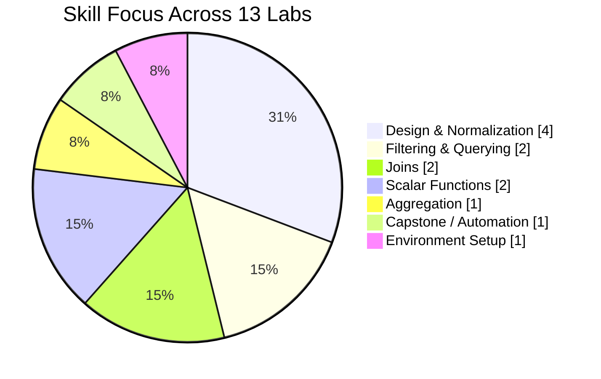
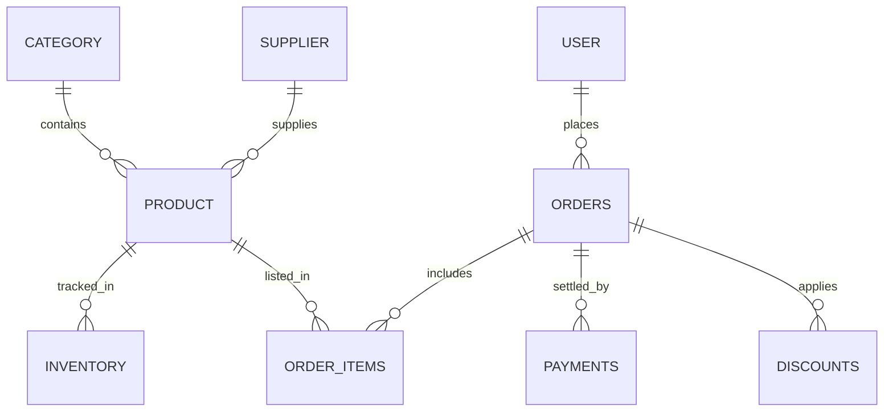
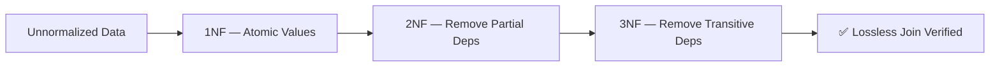
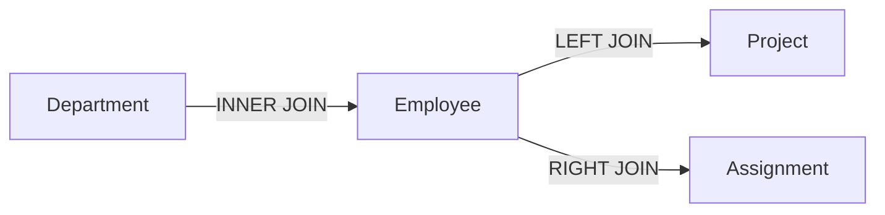
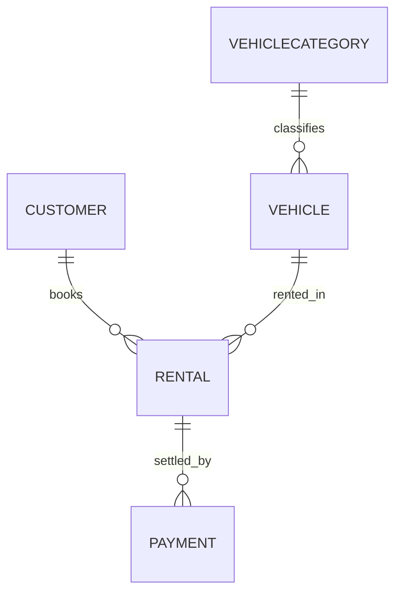
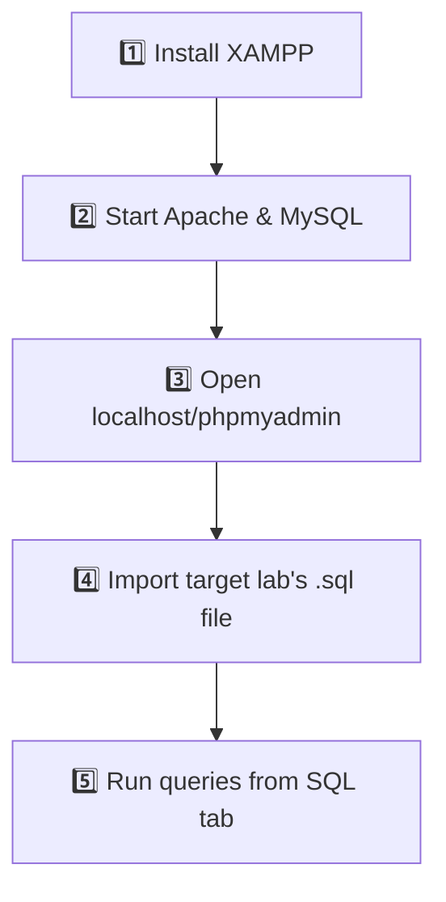

<div align="center">

# 🗄️ Database Systems — CS-2204
### Laboratory Portfolio · UAJK Muzaffarabad

[](https://dev.mysql.com/doc/)
[](https://www.apachefriends.org/)
[](https://www.phpmyadmin.net/)
[]()


<br>

<table>
<tr><td><b>👤 Student</b></td><td>Shahzad Ahmed Awan</td></tr>
<tr><td><b>🆔 Roll No.</b></td><td>2024-SE-15</td></tr>
<tr><td><b>📘 Course</b></td><td>Database Systems (CS-2204)</td></tr>
<tr><td><b>👨‍🏫 Instructor</b></td><td>Sir Awais Rathore</td></tr>
<tr><td><b>🏛️ Institution</b></td><td>UAJK Muzaffarabad</td></tr>
</table>

</div>

---

## 📌 Overview

This repository documents the complete laboratory journey for **Database Systems (CS-2204)** — thirteen progressive labs that build from environment setup to production-grade relational database design. It culminates in three real-world systems: a **Point-of-Sale platform**, a **university records database**, and a **car rental management system**.

---

## 🧭 Learning Roadmap


## 📊 Topic Distribution



---

## 🔬 Lab Index

<div align="center">

| # | Lab | Focus | Database | Type |
|:---:|---|---|:---:|:---:|
| `01` | [XAMPP Installation](#-01--installation-of-xampp) | Environment setup | — | 🟣 Setup |
| `02` | [POS Database](#-02--pos-database) | Full schema design | `pos_db` | 🔵 Design |
| `03` | [Keys & Queries](#-03--keys--queries) | Key types & basic SQL | `university_db` | 🔵 Design |
| `04` | [Normalization & 1NF](#-04--normalization--1nf) | First Normal Form | Bookstore/Hospital | 🔵 Design |
| `05` | [2NF & 3NF](#-05--2nf--3nf) | Advanced normalization | ← Lab 04 | 🔵 Design |
| `06` | [Filters — Part 1](#-06--sql-filters-part-1) | WHERE, comparisons | `filters_lab` | 🟢 Query |
| `07` | [Filters — Part 2](#-07--sql-filters-part-2) | BETWEEN, LIKE, IN | `filters_lab` | 🟢 Query |
| `08` | [Joins — Part 1](#-08--sql-joins-part-1) | INNER/LEFT/RIGHT | `joins_lab` | 🟢 Query |
| `09` | [Joins — Part 2](#-09--sql-joins-part-2) | SELF JOIN, chaining | `joins_lab` | 🟢 Query |
| `10` | [Scalar Fns — Part 1](#-10--scalar-functions-part-1) | String functions | `scalar_lab` | 🟠 Function |
| `11` | [Scalar Fns — Part 2](#-11--scalar-functions-part-2) | Numeric & date fns | `scalar_lab` | 🟠 Function |
| `12` | [Aggregate Functions](#-12--aggregate-functions) | GROUP BY / HAVING | `uni_lab` | 🟣 Aggregate |
| `13` | [Open-Ended Project](#-13--open-ended-project) | Capstone system | `carrental_db` | 🔴 Capstone |

</div>

---

## 📁 Repository Structure

```
📦 Database-Systems-CS-2204/
│
├── 🔒 .git/
│
├── 🗂️ DB_LAB_01_Installation_of_XAMPP/          🟣 Setup Lab
│   ├── 📄 DB_LAB_01.docx
│   └── 📄 DB_LAB_01.pdf
│
├── 🗂️ DB_LAB_02_POS_DATABASE/                   🔵 Design Lab
│   ├── 🗄️ Pos_System_DB_Schema.sql
│   ├── 🗄️ Report_Generation_Queries.sql
│   ├── 📄 README.md
│   ├── 📄 DB_LAB_02.docx
│   └── 📄 DB_LAB_02.pdf
│
├── 🗂️ DB_LAB_03_KEYS_AND_QUERIES/                🔵 Design Lab
│   ├── 🗄️ lab03_university_database.sql
│   ├── 📄 Readme.md
│   ├── 📄 DB_LAB_03.docx
│   └── 📄 ~$_LAB_03.docx
│
├── 🗂️ DB_LAB_04_Normalization_&_1NF/             🔵 Design Lab
│   ├── 🗄️ Lab04_Normalization_1NF.sql
│   └── 📄 README.md
│
├── 🗂️ DB_LAB_05_2NF_3NF/                         🔵 Design Lab
│   ├── 🗄️ Lab05_Normalization_2NF_3NF.sql
│   └── 📄 README.md
│
├── 🗂️ DB_LAB_06_Filters_part01/                  🟢 Query Lab
│   ├── 🗄️ Lab06_Filters_part01.sql
│   └── 📄 README.md
│
├── 🗂️ DB_LAB_07_Filters_part02/                  🟢 Query Lab
│   ├── 🗄️ Lab07_Filters_part02.sql
│   ├── 🗂️ Assessment on Filters in SQL/          📝 Assessment
│   │   ├── 🗄️ Lab07_Assessment_Bookstore.sql
│   │   └── 📄 README.md
│   └── 📄 README.md
│
├── 🗂️ DB_LAB_08_Joins_part01/                    🟢 Query Lab
│   ├── 🗄️ Lab08_Joins_part01.sql
│   └── 📄 README.md
│
├── 🗂️ DB_LAB_09_Joins_part02/                    🟢 Query Lab
│   ├── 🗄️ Lab09_Joins_part_2.sql
│   ├── 🗂️ Assessment Joins in SQL/               📝 Assessment
│   │   ├── 🗄️ Assessment_Joins.sql
│   │   └── 📄 README.md
│   └── 📄 README.md
│
├── 🗂️ DB_LAB_10_Scalar_Function_part_01/         🟠 Function Lab
│   ├── 🗄️ RollNo_Lab10_StringFunctions.sql
│   └── 📄 README.md
│
├── 🗂️ DB_LAB_11_Scalar_part02/                   🟠 Function Lab
│   ├── 🗄️ RollNo_Lab11_NumericDateFunctions.sql
│   ├── 🗂️ ASSESSMENT ON SCALAR FUNCTIONS/        📝 Assessment
│   │   ├── 🗄️ RollNo_Assessment_ScalarFunctions.sql
│   │   └── 📄 README.md
│   └── 📄 README.md
│
├── 🗂️ DB_LAB_12_Aggregate_Function/               🟣 Aggregate Lab
│   ├── 🗂️ Part-01-Tasks-Whole-table aggregates/
│   │   ├── 🗄️ RollNo_Lab12_PartA.sql
│   │   └── 📄 README.md
│   ├── 🗂️ Part02-Tasks-GROUP BY, HAVING, joins/
│   │   ├── 🗄️ RollNo_Lab12_PartB.sql
│   │   └── 📄 README.md
│   ├── 🗄️ RollNo_Assessment_AggregateFunctions.sql
│   └── 📄 README.md
│
└── 🗂️ DB_LAB_13_Open_Ended/                      🔴 Capstone Lab
    ├── 🗄️ CarRental_OpenEndedLab.sql
    ├── 🖼️ erd.png
    └── 📄 README.md
```

**Legend:** 🗂️ Lab folder · 🗄️ SQL script · 📄 Document/README · 🖼️ Image/Diagram · 📝 Assessment subfolder · 🔒 Git metadata

---

## 🔬 Lab Descriptions

### 🟣 01 — Installation of XAMPP

> **Focus:** Environment setup

Installing XAMPP with Apache & MySQL to establish the local development environment used throughout the course.

**Files:** `DB_LAB_01.docx` · `DB_LAB_01.pdf`

---

### 🔵 02 — POS Database

> **Focus:** Complete database design

A full Point-of-Sale system with 13 interlinked tables, foreign keys, and business-intelligence reporting queries.



**Schema:** Users · Products · Categories · Suppliers · Inventory · Orders · Payments · Discounts

**Files:** `Pos_System_DB_Schema.sql` · `Report_Generation_Queries.sql` · `README.md` · `DB_LAB_02.docx` · `DB_LAB_02.pdf`

```sql
SOURCE Pos_System_DB_Schema.sql;
SOURCE Report_Generation_Queries.sql;
```

---

### 🔵 03 — Keys & Queries

> **Focus:** Database keys & basic SQL

A university database implementing every major key type — Primary, Foreign, Unique, Composite, Surrogate, and Natural — alongside foundational SQL operations.

| Key Type | Example Usage |
|---|---|
| Primary Key | `student_id` |
| Foreign Key | `department_id` → Departments |
| Unique Key | `email` |
| Composite Key | `(course_id, semester)` |
| Surrogate Key | Auto-increment `id` |
| Natural Key | `national_id_number` |

**Database:** `university_db` → Departments · Students · Courses · Instructors · Enrollments

**Files:** `lab03_university_database.sql` · `Readme.md` · `DB_LAB_03.docx`

```sql
SOURCE lab03_university_database.sql;
```

---

### 🔵 04 — Normalization & 1NF

> **Focus:** First Normal Form

Converts unnormalized data into 1NF, covering functional dependencies, data anomalies, and atomic column structures.

**Scenarios:** Bookstore · Hospital

**Files:** `Lab04_Normalization_1NF.sql` · `README.md`

```bash
mysql -u root -p < Lab04_Normalization_1NF.sql
```

---

### 🔵 05 — 2NF & 3NF

> **Focus:** Advanced normalization
> **Prerequisite:** Lab 04 (builds on 1NF tables)



Eliminates partial and transitive dependencies to reach full normalization, with lossless-join verification.

**Files:** `Lab05_Normalization_2NF_3NF.sql` · `README.md`

```bash
mysql -u root -p < Lab05_Normalization_2NF_3NF.sql
```

---

### 🟢 06 — SQL Filters (Part 1)

> **Focus:** WHERE clause & basic filtering

Comparison operators (`>` `<` `=` `>=` `<=` `!=`) combined with logical operators (`AND` `OR` `NOT`).

**Database:** `filters_lab` → Employee table (15 records)

**Files:** `Lab06_Filters_part01.sql` · `README.md`

```sql
SOURCE Lab06_Filters_part01.sql;
```

---

### 🟢 07 — SQL Filters (Part 2)

> **Focus:** Advanced filtering

`BETWEEN` · `IN` · `LIKE` · `IS NULL` · `ORDER BY` · `LIMIT` — plus a bookstore assessment.

**Database:** `filters_lab` + Bookstore assessment

**Files:** `Lab07_Filters_part02.sql` · `README.md`
**Assessment:** `Assessment on Filters in SQL/Lab07_Assessment_Bookstore.sql` · `Assessment on Filters in SQL/README.md`

```sql
SOURCE Lab07_Filters_part02.sql;
```

---

### 🟢 08 — SQL Joins (Part 1)

> **Focus:** Basic join operations



**Database:** `joins_lab` → Department · Employee · Project · Assignment

**Files:** `Lab08_Joins_part01.sql` · `README.md`

```sql
SOURCE Lab08_Joins_part01.sql;
```

---

### 🟢 09 — SQL Joins (Part 2)

> **Focus:** Advanced joins

`SELF JOIN`, multi-table joins, join chaining, and aggregation over joined data.

**Database:** `joins_lab` (self-referencing relationships)

**Files:** `Lab09_Joins_part_2.sql` · `README.md`
**Assessment:** `Assessment Joins in SQL/Assessment_Joins.sql` · `Assessment Joins in SQL/README.md`

```sql
SOURCE Lab09_Joins_part_2.sql;
```

---

### 🟠 10 — Scalar Functions (Part 1)

> **Focus:** String functions

`TRIM` · `UPPER`/`LOWER` · `CONCAT` · `SUBSTRING` · `LEFT`/`RIGHT` · `LPAD` · `LOCATE` · `REPLACE`

**Database:** `scalar_lab` → Customer & Product tables

**Files:** `RollNo_Lab10_StringFunctions.sql` · `README.md`

```sql
SOURCE RollNo_Lab10_StringFunctions.sql;
```

---

### 🟠 11 — Scalar Functions (Part 2)

> **Focus:** Numeric & date functions

`ROUND` · `CEIL` · `FLOOR` · `MOD` · `DATE_FORMAT` · `DATEDIFF` · `TIMESTAMPDIFF` · `DATE_ADD`/`SUB`

**Database:** `scalar_lab` (numeric & temporal data)

**Files:** `RollNo_Lab11_NumericDateFunctions.sql` · `README.md`
**Assessment:** `ASSESSMENT ON SCALAR FUNCTIONS/RollNo_Assessment_ScalarFunctions.sql` · `ASSESSMENT ON SCALAR FUNCTIONS/README.md`

```sql
SOURCE RollNo_Lab11_NumericDateFunctions.sql;
```

---

### 🟣 12 — Aggregate Functions

> **Focus:** Data aggregation & grouping

`COUNT` · `SUM` · `AVG` · `MIN` · `MAX` combined with `GROUP BY` and `HAVING`.

**Database:** `uni_lab` → Student · Course · Enrollment tables

**Files:** `RollNo_Assessment_AggregateFunctions.sql` · `README.md`
**Part 1:** `Part-01-Tasks-Whole-table aggregates/RollNo_Lab12_PartA.sql` · `Part-01-Tasks-Whole-table aggregates/README.md`
**Part 2:** `Part02-Tasks-GROUP BY, HAVING, joins/RollNo_Lab12_PartB.sql` · `Part02-Tasks-GROUP BY, HAVING, joins/README.md`

```sql
-- Part 1
SOURCE "Part-01-Tasks-Whole-table aggregates/RollNo_Lab12_PartA.sql";
-- Part 2
SOURCE "Part02-Tasks-GROUP BY, HAVING, joins/RollNo_Lab12_PartB.sql";
-- Assessment
SOURCE RollNo_Assessment_AggregateFunctions.sql;
```

---

### 🔴 13 — Open-Ended Project

> **Focus:** Complete database system (capstone)

A full car-rental management system featuring normalization, views, triggers, stored procedures, and performance optimization.



**Database:** `carrental_db` → Customer · VehicleCategory · Vehicle · Rental · Payment

**Highlights:** Vehicle availability tracking · Rental lifecycle management · Payment processing · Process automation via triggers & stored procedures

**Files:** `CarRental_OpenEndedLab.sql` · `erd.png` · `README.md`

```sql
SOURCE CarRental_OpenEndedLab.sql;
```

📎 Entity-Relationship Diagram: `erd.png`

---

## 🛠️ Tech Stack & Setup

<div align="center">


</div>



---

## 📊 Repository Statistics

<div align="center">

| 📚 Labs | 🗄️ SQL Files | 🧱 Tables | 📝 Records | 🏢 Scenarios |
|:---:|:---:|:---:|:---:|:---:|
| **13** | **20+** | **50+** | **500+** | **6** |

</div>

---

## 🎓 Learning Outcomes

- ✅ Design normalized relational databases
- ✅ Write efficient, readable SQL queries
- ✅ Implement complex schemas with proper constraints
- ✅ Optimize performance through indexing
- ✅ Automate workflows with triggers & stored procedures
- ✅ Analyze data using aggregate functions
- ✅ Build complete, real-world database applications

---

## 🔗 Resources

- 📘 [MySQL Documentation](https://dev.mysql.com/doc/)
- 📗 [phpMyAdmin Documentation](https://docs.phpmyadmin.net/)
- 📙 [XAMPP Documentation](https://www.apachefriends.org/docs.html)

---

<div align="center">

### **Shahzad Ahmed Awan** · 2024-SE-15
📧 Submitted to **Sir Awais Rathore**
🏛️ UAJK Muzaffarabad — CS-2204

⭐ *If this helped you, consider starring the repo!*

</div>
